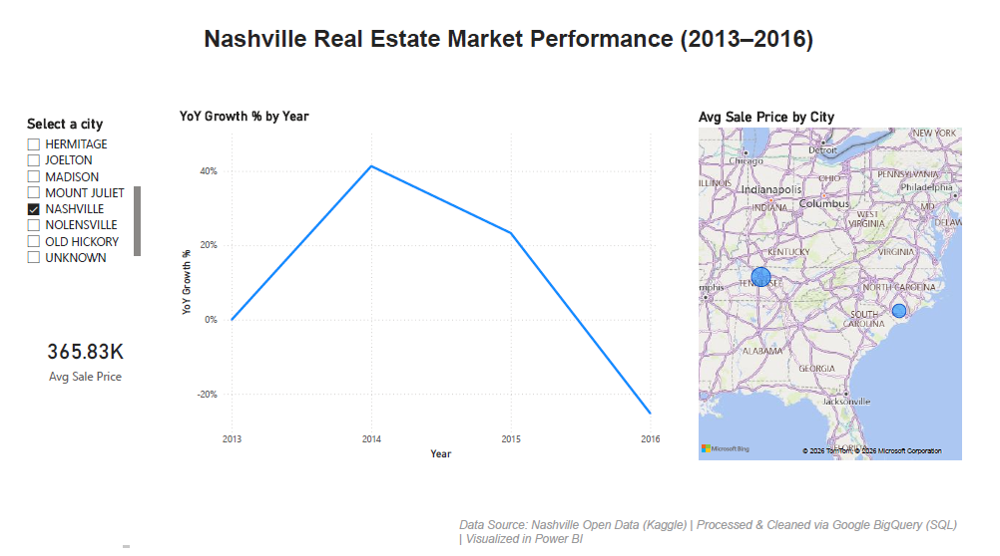

# Nashville Housing: Data Cleaning & Market Analysis

An end-to-end data analysis project showcasing how to transform raw, inconsistent housing records into actionable business insights using SQL and Power BI.

## 🎯 Project Objective
The goal of this project was to clean a raw dataset of over 56,000 property records and perform an exploratory data analysis (EDA) to identify market appreciation trends in Nashville between 2013 and 2016.

## 🛠️ Tech Stack
* **Database:** Google BigQuery (SQL)
* **Visualization:** Power BI (DAX, Time Intelligence)
* **Environment:** SQL script documentation and version control via GitHub

## 🧹 Data Cleaning Process
I utilized SQL to address several real-world data quality issues:
1. **Address Normalization:** Used `SPLIT` and `COALESCE` to separate street addresses from city names, handling missing data points effectively.
2. **Standardizing Categorical Data:** Converted inconsistent 'Y/N' entries into clean 'Yes/No' values using `CASE` statements.
3. **Date Parsing:** Standardized string-based date formats into proper `DATE` types to enable time-series analysis in Power BI.

## 📈 Key Insights
* **Market Appreciation:** By calculating Year-over-Year (YoY) growth, I identified the periods of highest market volatility and appreciation.
* **Geographic Trends:** The dashboard allows stakeholders to drill down by municipality to identify which areas saw the highest demand.

## 📂 Project Structure
* `Nashville_Analysis_Insights.sql`: Full SQL script including cleaning queries and analytical insights.
* `Nashville_Housing_Dashboard.pbix`: The source Power BI report file.
* `Nashville_Housing_Dashboard.png`: A high-resolution preview of the final dashboard.

---
*Created by Keerti Upadhyay*
